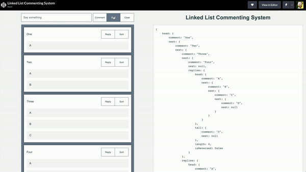
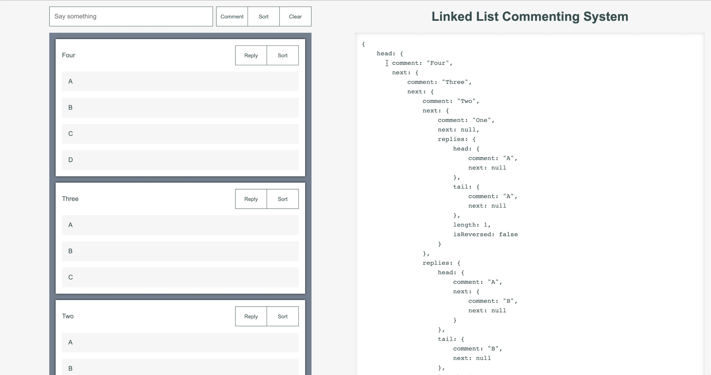

# Linked List Commenting System

- This might be good for something like ephemeral commenting for teams using websockets.
- Top-level comments are a linked list, and each comment node has a `replies` property which itself is a linked list.
- The sort buttons are using a `.reverse()` method such that sorting top-level comments, and replies for each comment, can be done independently.

## YouTube Video Walkthrough

